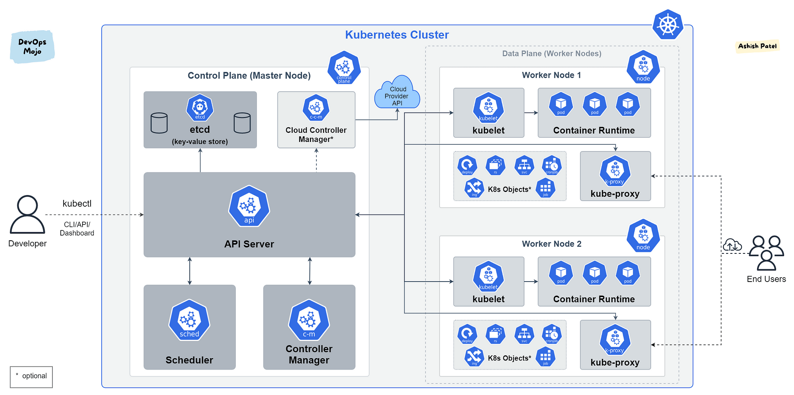

# Kubernetes: Cluster Components 

---

Kubernetes состоит из множества компонентов, каждый из которых выполняет свою 
роль в работе кластера. Компоненты Kubernetes можно разделить 
на две основные категории: 
**компоненты Control Plane (управляющей плоскости)** 
и **компоненты Node (рабочих узлов)**.

### 1. Компоненты Control Plane

Control Plane — это управляющая плоскость Kubernetes, которая отвечает за поддержание состояния кластера, обеспечение выполнения задач и управление рабочими узлами.

#### Основные компоненты Control Plane:

##### 1.1. `kube-apiserver`
`kube-apiserver` — это основной API-сервер Kubernetes, который обеспечивает коммуникацию между всеми компонентами кластера. Все запросы от пользователей, внутренних компонентов и внешних систем проходят через `kube-apiserver`.

- **Функции**: принимает и обрабатывает REST-запросы (на создание, обновление, удаление объектов в кластере) и передает команды другим компонентам.
- **Особенности**: выполняет аутентификацию и авторизацию запросов, а также валидацию и обработку данных перед тем, как записать их в хранилище `etcd`.

##### 1.2. `etcd`
`etcd` — это распределенное, высоконадёжное хранилище ключ-значение, в котором Kubernetes хранит всю конфигурацию и состояние кластера.

- **Функции**: хранит данные о подах, конфигурациях, политике безопасности и других объектах Kubernetes. Считается «мозгом» кластера, так как от его состояния зависит работа всего кластера.
- **Особенности**: может быть реплицирован для обеспечения отказоустойчивости. В случае выхода из строя `etcd` данные кластера могут быть утеряны, поэтому его обычно резервируют.

##### 1.3. `kube-scheduler`
`kube-scheduler` — это компонент, отвечающий за распределение подов (pods) между рабочими узлами (нодами).

- **Функции**: при создании пода `kube-scheduler` анализирует доступные узлы и решает, на каком узле будет запущен под.
- **Особенности**: использует различные критерии для выбора узла, включая ресурсы узла, ограничения пода, распределение нагрузки и анти-аффинити правила.

##### 1.4. `kube-controller-manager`
`kube-controller-manager` — это компонент, отвечающий за управление различными контроллерами Kubernetes. Контроллеры — это циклы, которые непрерывно проверяют текущее состояние объектов в кластере и пытаются привести его к желаемому состоянию.

- **Функции**: каждый контроллер отвечает за свой тип ресурсов, например:
  - **Node Controller** — следит за состоянием узлов.
  - **Replication Controller** — управляет количеством реплик подов.
  - **Endpoint Controller** — создает связи между сервисами и подами.
  - **Service Account и Token Controller** — создают учетные записи и токены для подов.
- **Особенности**: каждый контроллер работает как самостоятельный процесс, но в `kube-controller-manager` они объединены для удобства и лучшей производительности.

##### 1.5. `cloud-controller-manager`
`cloud-controller-manager` — это компонент, который взаимодействует с облачными провайдерами. Он используется только в кластерах, развернутых в облаке.

- **Функции**: управляет ресурсами облачного провайдера, такими как балансировщики нагрузки, тома для хранения данных и сетевые адреса.
- **Особенности**: разделяет управление ресурсами кластера и облака, что позволяет использовать облачные возможности для ресурсов кластера.

### 2. Компоненты Worker Node (рабочих узлов)

Рабочие узлы, или воркеры, — это серверы (физические или виртуальные), на которых запускаются контейнеризированные приложения в подах. Они получают команды от Control Plane и выполняют приложения.

#### Основные компоненты Node:

##### 2.1. `kubelet`
`kubelet` — это агент, запущенный на каждом рабочем узле, который отвечает за управление подами на узле.

- **Функции**: `kubelet` следит за подами на узле и гарантирует, что все контейнеры работают. Он получает спецификации подов от `kube-apiserver` и следит за тем, чтобы состояние подов соответствовало их спецификации.
- **Особенности**: выполняет мониторинг состояния подов и отправляет данные о состоянии в `kube-apiserver`.

##### 2.2. `kube-proxy`
`kube-proxy` — это сетевой прокси-сервер, который управляет сетевой связью между подами и сервисами на каждом узле.

- **Функции**: реализует сетевые правила, позволяющие подам взаимодействовать друг с другом и с внешними приложениями. `kube-proxy` направляет трафик к подам на основе IP-адресов и портов.
- **Особенности**: может использовать разные способы настройки сетевых правил, включая `iptables` и `IPVS` для высокой производительности.

##### 2.3. Контейнерный Runtime (Container Runtime)
Контейнерный Runtime — это программа, которая непосредственно выполняет контейнеры на узле. Kubernetes поддерживает несколько вариантов runtime, включая Docker, containerd и CRI-O.

- **Функции**: отвечает за запуск, остановку и управление контейнерами на узле.
- **Особенности**: `kubelet` взаимодействует с контейнерным runtime через CRI (Container Runtime Interface) для обеспечения совместимости с разными системами.

### Дополнительные компоненты и объекты Kubernetes

#### 3. DNS (CoreDNS)
CoreDNS — это система доменных имен для Kubernetes, которая автоматически создает DNS-записи для всех сервисов и подов. Это позволяет приложениям в кластере общаться друг с другом по именам.

- **Функции**: обеспечивает DNS-названия для всех сервисов и подов в кластере, упрощая их взаимодействие.
- **Особенности**: помогает избежать жесткой привязки к IP-адресам и упрощает архитектуру сетевого взаимодействия.

#### 4. Ingress Controller
Ingress Controller — это компонент, который управляет правилами Ingress, определяющими маршрутизацию внешнего HTTP и HTTPS трафика к сервисам в кластере.

- **Функции**: управляет доступом к сервисам через единый точку входа.
- **Особенности**: позволяет гибко настраивать маршруты на основе URL-путей и хостов, что упрощает доступ к микросервисам и настройку доменов.

#### 5. Dashboard
Kubernetes Dashboard — это веб-интерфейс для визуализации и управления ресурсами кластера, включая поды, сервисы, конфигурации и настройки.

- **Функции**: обеспечивает удобный интерфейс для мониторинга и управления кластером.
- **Особенности**: предоставляет доступ к метрикам и логам, а также возможность управлять ресурсами напрямую из интерфейса.

#### 6. Volume и PersistentVolume (PV, PVC)
Volumes — это механизмы хранения данных в Kubernetes. `PersistentVolume` (PV) — это хранилище данных, которое может быть выделено для подов. `PersistentVolumeClaim` (PVC) — это запрос на использование PersistentVolume от пода.

- **Функции**: PersistentVolume используется для долговременного хранения данных, в то время как PVC позволяет поду динамически запрашивать и подключать хранилище.
- **Особенности**: обеспечивает постоянное хранилище, сохраняющее данные даже после перезапуска пода.

### Общая архитектура Kubernetes

Архитектура Kubernetes построена на принципе разделения управления и выполнения. Control Plane управляет всей системой, обеспечивает выполнение подов и следит за состоянием кластера, в то время как рабочие узлы непосредственно выполняют контейнеризированные приложения. Kubernetes обеспечивает высокую доступность и масштабируемость благодаря тому, что:
- Control Plane можно запускать с репликами для отказоустойчивости.
- `etcd` также может быть реплицирован.
- Рабочие узлы могут добавляться и удаляться по мере необходимости для масштабирования приложений.

Эта гибкая архитектура делает Kubernetes мощным инструментом для автоматизации работы контейнеризированных приложений в больших и динамичных средах.